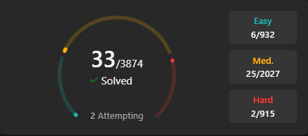

# 📚 Data Structures & Algorithms

A personal repository for practicing and mastering Data Structures, Algorithms, and Problem-Solving Patterns through hands-on implementations and LeetCode challenges.

---

## 🖼️ [LeetCode Progress](https://leetcode.com/progress/)



---

## 📦 Linear Data Structures

### [Array](Array)
- Fundamental array operations and problem solving
- Topics: traversal, searching, subarrays, prefix sums, and more

### [Strings](Strings)
- String manipulation and pattern problems
- Topics: anagrams, palindromes, substrings, and more

### [Linked List](./Linked%20list/)
- Singly and doubly linked list implementations
- Topics: reversal, cycle detection, middle node, and more

### [Stack](./Stack/)
- Stack-based problem solving
- Topics: postfix evaluation, balanced parentheses, monotonic stack, and more

### [Queue](./Queue/)
- Queue implementations and applications
- Topics: circular queue, deque, BFS applications, and more

---

## ⚙️ Algorithms

### [Binary Search](./Binary_Search/)
- Classic and advanced binary search problems
- Topics: search on answers, rotated arrays, capacity/shipping problems, and more

### [Sorting](./Sorting/src/)
- Core sorting algorithm implementations
- Topics: quick sort, merge sort, partition method, and more

---

## 🔁 Patterns

### [Two Pointer & Sliding Window](./Two%20Pointer%20%26%20sliding%20Window/)
- Efficient linear-time techniques for array/string problems
- Topics: fixed/variable windows, longest substrings, pair sums, and more

### [Recursion & Backtracking](Backtracking/Backtracking-Questions/src/)
- Recursive thinking and backtracking strategies
- Topics: memoization, N-Queens, subsets, permutations, and more

---

## 🚀 Getting Started

Clone the repository and navigate to any topic folder:

```bash
git clone https://github.com/Taha-Sayyed/<repo-name>.git
cd <repo-name>
```

---

## 📈 Progress Tracker

- [x] Arrays
- [x] Strings
- [x] Linked List
- [x] Stack
- [x] Queue
- [x] Binary Search
- [x] Sorting
- [x] Two Pointer & Sliding Window
- [x] Recursion & Backtracking
---

**Happy Coding! 🎯**
